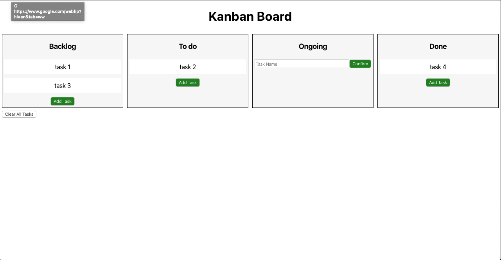
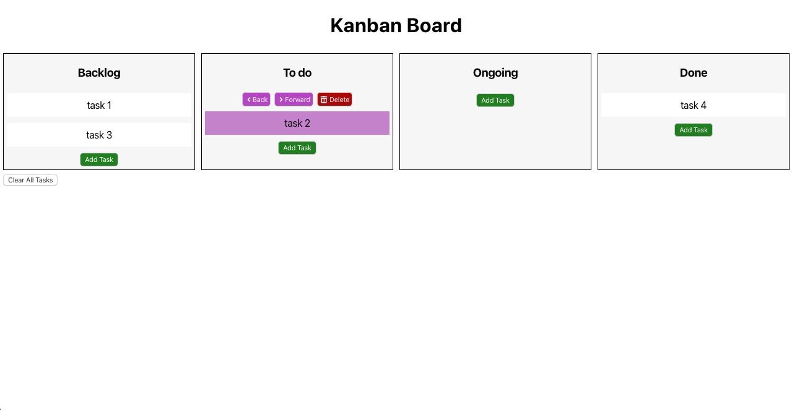
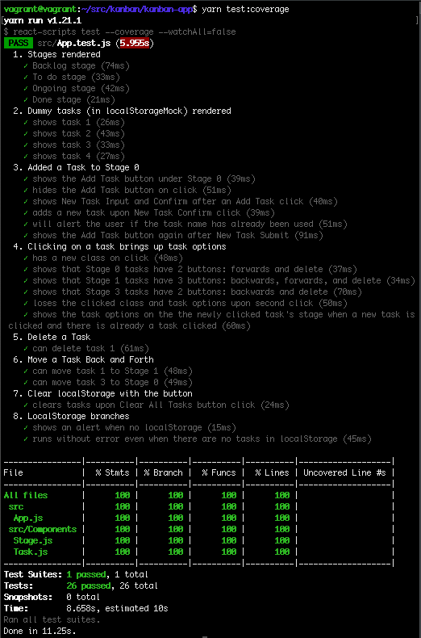

# A Simple Kanban Board

#### Developed by: [Willa Qu](https://www.linkedin.com/in/michelle-willa-qu/)

 
A kanban board with some data persistence. Built with create-react-app and BlueprintJS, this project was a focus on learning libraries (react-testing-library and BlueprintJS) and modularized React code in the form of a single-page React app.

Why?: Based on a timed coding challenge I received and did terribly on. I decided to work through the problem and understand each step, especially the testing. I also added HTML5 LocalStorage for some data persistence and I will experiment with other front-end data storages in the future.

### Features

 
Users can add tasks to one of the four categories. Tasks cannot have the same name since the unique identifier of a task is its name. If the new task name is already active, the user will be alerted. The 'Clear All Tasks' button will clear all the tasks on the screen. When the tab or window is closed, the app will save all the task data to the web browser's localStorage for retrieval on the next visit.
 
 
Clicking on a task highlights the task in pink and brings up options for that task. The task can be moved with the 'Back' and 'Forward' buttons (the stages on the ends are lacking one of the buttons to keep the logic sound). The delete button will delete the task.

### Testing

A current 96% test coverage and an overview of all the tests run.
 

### To do

- Achieve 100% test coverage

### Usage

`yarn start`
 
Runs the app in the development mode.
Open [http://localhost:5000](http://localhost:5000) to view it in the browser. 

`yarn test`
 
Launches the test runner in the interactive watch mode. 

`yarn test:coverage`
 
Runs all the tests and outputs the coverage percentages directly in the terminal. For a more detailed coverage report, look at ./coverage/lcov-report/index.html after the command is run. 
